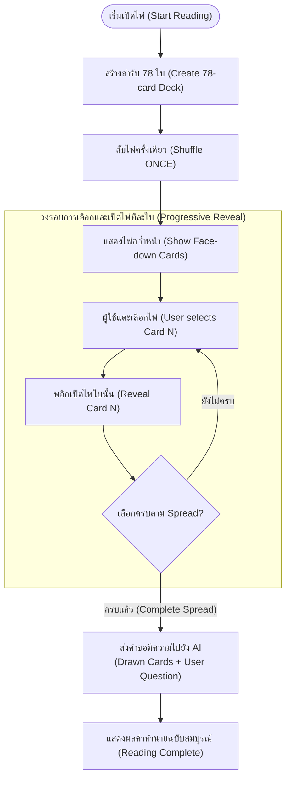
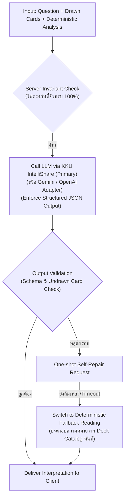
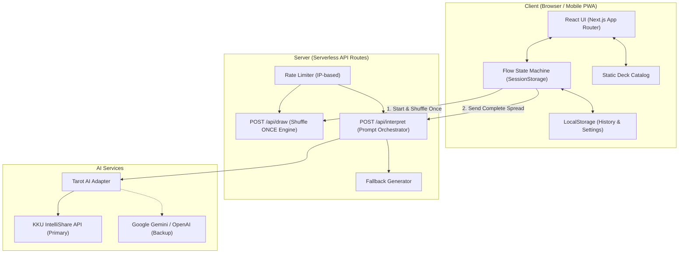

# Arcanfractal — Software Design Document (SDD)

## AI-Assisted Tarot Reading Web Application

| หัวข้อ             | รายละเอียด                                                             |
| ------------------ | ---------------------------------------------------------------------- |
| **ชื่อโปรเจกต์**   | **Arcanfractal** (ยืนยันแล้วจาก Q-001)                                 |
| **เวอร์ชัน**       | 2.1 (Tarot Reading Model & Lifecycle Blueprint)                        |
| **สถานะ**          | `[Proposed]` รอรีวิวก่อนเริ่มพัฒนา                                     |
| **กฎเหล็กการสุ่ม** | **"Shuffle once per Reading, select multiple cards, interpret once."** |

---

# 1. Overview

**Arcanfractal** คือเว็บแอปพลิเคชันเปิดไพ่ทาโรต์ส่วนบุคคลบนสมาร์ตโฟนและเดสก์ท็อป ภายใต้แนวคิด:

> **"A Ritual with an AI Voice — พิธีกรรมที่สงบ โดยมี AI เป็นเพียงผู้ช่วยอ่านความหมาย ไม่ใช่แชตบอตทั่วไป"**

### จุดเน้นสำคัญของระบบ

- **Cards are Ground Truth:** ระบบสุ่มไพ่ถูกควบคุมโดย Tarot Engine ที่ตรวจสอบได้ 100% AI มีหน้าที่เพียง "ตีความ" ไพ่ที่จั่วได้จริงเท่านั้น โดยไม่มีสิทธิ์เปลี่ยนหรือเพิ่มไพ่เอง
- **Strict Separation (Question vs Randomization):** คำถามของผู้ใช้ **ไม่มีผลต่อการสุ่มไพ่เด็ดขาด** การสุ่มเกิดจาก Tarot Deck เท่านั้น คำถามจะถูกนำมาใช้ภายหลังเป็น Context ให้ AI ตีความ
- **Reflection > Prediction:** มุ่งเน้นการสะท้อนสภาวะจิตใจและสร้างความเข้าใจ ไม่ใช่การทำนายอนาคตแบบงมงาย
- **Private by Default:** ไม่เก็บคำถามหรือคำทำนายลงฐานข้อมูล Server ใน MVP ข้อมูลทั้งหมดถูกเก็บไว้ในเครื่องของผู้ใช้เท่านั้น

### กลุ่มผู้ใช้เป้าหมาย

- **Primary (The Curious Reflector):** อายุ 18–35 ปี ใช้งานเพื่อผ่อนคลายและสะท้อนตนเอง 2–5 นาทีบนมือถือ
- **Secondary (The Hobbyist):** ผู้มีความรู้ด้านทาโรต์ ต้องการคำทำนายที่เคารพตำแหน่งไพ่และไพ่กลับหัวอย่างถูกต้อง
- **Non-targets:** ผู้ต้องการคำปรึกษาทางการแพทย์ กฎหมาย การเงิน หรือภาวะวิกฤตจิตเวช

---

# 2. Core Experience & User Flow

กระบวนการใช้งานถูกออกแบบให้เป็น **พิธีกรรม 1 ทิศทาง (Linear Ritual):** 1 คำถาม → 1 Deck สับครั้งเดียว → เลือกและเปิดทีละใบ → ตีความ 1 ครั้ง



| ขั้นตอน                | การกระทำของผู้ใช้                       | พฤติกรรมของระบบ                                                                | หลักการออกแบบ (UX Principle) |
| ---------------------- | --------------------------------------- | ------------------------------------------------------------------------------ | ---------------------------- |
| **1. Question**        | พิมพ์คำถาม (5–500 ตัวอักษร)             | บันทึกคำถามไว้ใช้เป็น Context (ไม่มีผลต่อการสุ่มไพ่)                           | Reflection Anchor            |
| **2. Spread**          | เลือกรูปแบบ Spread (1, 3, 5 ใบ)         | กำหนดจำนวนไพ่ $N$ ที่ต้องเลือกในรอบนี้                                         | Clear Scope                  |
| **3. Shuffle Once**    | กดเริ่มทำพิธี ดูแอนิเมชันสับไพ่         | **สร้าง Deck 78 ใบ และ Shuffle เพียงครั้งเดียว**                               | **1 Reading = 1 Deck**       |
| **4. Select & Reveal** | แตะเลือกไพ่ทีละใบจากตำแหน่งที่คว่ำอยู่  | เปิดเผยไพ่ที่อยู่ ณ ตำแหน่งนั้นจริงๆ ตามสำรับที่สับไว้ (True Pick) ทีละใบจนครบ | **True Index Selection**     |
| **5. Interpretation**  | รอดูผลเมื่อเปิดครบ $N$ ใบ               | รวบรวมไพ่ทั้งหมด + คำถาม ส่งให้ AI ตีความครั้งเดียว                            | Grounded Context             |
| **6. Result**          | อ่านผลลัพธ์ แตะดูความหมาย คัดลอกข้อความ | บันทึกลง Local History อัตโนมัติ (กดดูดวงใหม่เพื่อเริ่ม Deck ใหม่)             | Calm Closure                 |

---

# 3. Features & Scope

| Feature                         | คำอธิบาย                                                                              | สถานะ      |
| ------------------------------- | ------------------------------------------------------------------------------------- | ---------- |
| **Question Guidance**           | ช่องกรอกคำถาม + แนะนำปรับรูปประโยคแบบเปิด (ไม่มีผลต่อการสุ่ม)                         | `[MVP]`    |
| **78-Card Deck Catalog**        | ข้อมูลไพ่ 78 ใบ (Major 22 + Minor 56) ภาพและคำแปลสมบูรณ์                              | `[MVP]`    |
| **Shuffle Once Engine**         | สุ่มไพ่ครั้งเดียวต่อ 1 Reading ด้วย Web Crypto API ปลอดภัย ไร้ Modulo Bias            | `[MVP]`    |
| **No Duplicate Rule**           | ไพ่ไม่ซ้ำกันอย่างเด็ดขาดภายใน Reading เดียวกัน                                        | `[MVP]`    |
| **Progressive Card Reveal**     | ผู้ใช้จิ้มเลือกเองและเปิดทีละใบ สร้างความรู้สึกลุ้นและเป็นเจ้าของการเลือก             | `[MVP]`    |
| **4 Core Spreads**              | 1 ใบ, 3 ใบ (Timeline & Guidance), 5 ใบ (Path)                                         | `[MVP]`    |
| **Reversed Cards**              | ไพ่กลับหัวแบบสุ่มอิสระ 50% ต่อใบ (มีสวิตช์เปิด/ปิด, ค่าเริ่มต้น Off ปิดอยู่ตาม Q-002) | `[MVP]`    |
| **Grounded AI Interpretation**  | ตีความตามไพ่จริงด้วย JSON Schema + Hallucination Guard                                | `[MVP]`    |
| **Deterministic Fallback**      | คำทำนายสำรองจากฐานข้อมูลเมื่อ AI ล่ม ทำให้การดูดวงสำเร็จเสมอ                          | `[MVP]`    |
| **Local Reading History**       | บันทึกผลลัพธ์ในเครื่องผู้ใช้ (LocalStorage) สูงสุด 100 รายการ                         | `[MVP]`    |
| **Card Detail Sheet**           | แตะไพ่ในผลลัพธ์เพื่อเปิดดูความหมายฉบับเต็ม                                            | `[MVP]`    |
| **Copy as Text**                | คัดลอกผลการดูดวงทั้งหมดลง Clipboard                                                   | `[MVP]`    |
| **Crisis Safety Support**       | ตรวจจับคำถามอันตราย สลับแสดงสายด่วนช่วยเหลือฉุกเฉิน                                   | `[MVP]`    |
| **Rate Limiting**               | จำกัดการเรียกใช้ AI ต่อ IP เพื่อคุมงบประมาณ                                           | `[MVP]`    |
| **User Accounts & Cloud Sync**  | สมัครสมาชิก ล็อกอิน ซิงค์ข้อมูลข้ามเครื่อง                                            | `[Future]` |
| **Social Share & Image Export** | สร้างภาพสรุปคำทำนาย หรือแชร์ลิงก์สาธารณะ                                              | `[Future]` |
| **AI Follow-up Chat**           | พูดคุยซักถามต่อเนื่องกับ AI                                                           | `[Future]` |
| **Celtic Cross (10 Cards)**     | Spread ขนาดใหญ่ 10 ใบ                                                                 | `[Future]` |

---

# 4. Tarot System Design

## 4.1 Tarot Reading Model: 1 Reading = 1 Randomized Deck

ทุกครั้งที่ผู้ใช้เริ่มการดูดวงรอบใหม่:

1. ระบบสร้างสำรับไพ่ 78 ใบขึ้นมาใหม่
2. ทำการ **Shuffle / Randomize เพียงครั้งเดียว** เมื่อเริ่มต้น
3. ใช้สำรับที่สับแล้วนี้เป็นตัวแทนของ Reading นั้นตลอดการอ่าน
4. ผู้ใช้จิ้มเลือกไพ่ทีละใบจนครบตาม Spread
5. ไพ่ที่เลือกจะถูกเปิดเผยทีละใบตามลำดับ
6. เมื่อครบแล้วจึงนำไพ่ทั้งหมดไปตีความ (Interpret Once)

```text
[ถูกต้อง - แบบที่ระบบใช้]
Shuffle ครั้งเดียว → Select & Reveal Card 1 → Select & Reveal Card 2 → Select & Reveal Card 3 → Complete

[ผิด - ห้ามทำเด็ดขาด]
Shuffle → Select Card 1 → Shuffle ใหม่ → Select Card 2 → Shuffle ใหม่ → Select Card 3
```

## 4.2 True Index Selection (กดตำแหน่งไหน ได้ใบนั้นจริง 100%)

- **ไพ่ทุกใบที่คว่ำอยู่บนหน้าจอมีตัวตนและตำแหน่งจริง:** เมื่อระบบสับสำรับ 78 ใบ ไพ่แต่ละใบจะถูกกำหนดตำแหน่ง (Index 0 ถึง 77) ในสำรับของรอบนั้นอย่างแท้จริง
- **จิ้มตำแหน่งไหน ได้ใบที่อยู่ตรงนั้นจริง 100% (ไม่มีการสวมผลลัพธ์):**
  - _ตัวอย่าง:_ ในรอบที่ 1 เมื่อสับไพ่แล้ว ตำแหน่งแรกคือ The Moon ผู้ใช้จิ้มใบแรก ก็จะได้ The Moon จริงๆ
  - เมื่อเริ่มรอบที่ 2 (เรื่องใหม่) สำรับจะถูกสับใหม่หมด หากผู้ใช้ลองจิ้มใบแรกซ้ำ คราวนี้อาจได้ The Empress ตามผลการสับของรอบใหม่จริงๆ
- **No Re-pick:** ไพ่ตำแหน่งที่ถูกเลือกไปแล้วจะถูกดึงออกจากโต๊ะ ไม่สามารถจิ้มซ้ำได้ในรอบเดียวกัน รับประกันกฎห้ามซ้ำโดยธรรมชาติของการหยิบไพ่จริง

## 4.3 No Duplicate Rule (กฎห้ามซ้ำ)

- **ห้ามได้ไพ่ซ้ำกันภายใน Reading เดียวกันอย่างเด็ดขาด:** เนื่องจากไพ่ทั้งหมดถูกดึงออกมาจากสำรับ 78 ใบเดียวกันที่สับไว้แล้วรอบเดียว (Sampling without replacement)
- **อนุญาตให้ซ้ำข้าม Reading ได้ตามปกติ:** เมื่อผู้ใช้กด "ดูดวงใหม่" ระบบจะสร้าง Deck ใหม่และสับใหม่ทั้งหมด ดังนั้น ไพ่ใน Reading #2 จึงมีโอกาสซ้ำกับ Reading #1 ได้ตามหลักสถิติธรรมชาติ

## 4.4 Question vs Randomization (คำถามกับการสุ่ม)

- **คำถามไม่มีผลต่อการสุ่มไพ่:** ระบบต้องไม่คัดเลือกไพ่ที่ "ดูเข้ากันได้กับคำถาม" (เช่น ถามเรื่องความรัก ไม่ใช่จงใจสุ่มไพ่ The Lovers มาให้)
- การสุ่มต้องบริสุทธิ์ 100% จาก Tarot Deck เท่านั้น คำถามจะถูกนำมาผสานภายหลังเพื่อใช้เป็นบริบทในการตีความ:

```text
Randomized Deck ──────► User Selection ──────► Drawn Cards
                                                   +
                                              User Question
                                                   ↓
                                           AI Interpretation
```

## 4.5 Spreads & Position Meanings

| Spread ID        | ชื่อ                             | จำนวน | ตำแหน่งและบทบาท                                                                                                                                                     | ความสัมพันธ์ระหว่างตำแหน่ง                                                             |
| ---------------- | -------------------------------- | ----- | ------------------------------------------------------------------------------------------------------------------------------------------------------------------- | -------------------------------------------------------------------------------------- |
| `single`         | Single Card                      | 1     | `[1] message`: แก่นพลังงานหรือคำแนะนำหลัก                                                                                                                           | —                                                                                      |
| `three-timeline` | Past · Present · Future          | 3     | `[1] past`: อดีตที่ส่งผล<br>`[2] present`: แกนกลางปัจจุบัน<br>`[3] future`: แนวโน้มหากไม่เปลี่ยนทิศทาง                                                              | Past หล่อหลอม Present → Present นำไปสู่ Future                                         |
| `three-guidance` | Situation · Challenge · Guidance | 3     | `[1] situation`: ข้อเท็จจริงของเรื่อง<br>`[2] challenge`: อุปสรรคที่ขวางอยู่<br>`[3] guidance`: ทัศนคติ/ทางออกที่ควรใช้                                             | Challenge ขัดขวาง Situation → Guidance ตอบโจทย์ Challenge                              |
| `five-path`      | Five-Card Path                   | 5     | `[1] heart`: แก่นเรื่อง<br>`[2] obstacle`: สิ่งกีดขวาง<br>`[3] foundation`: รากฐานเบื้องลึก<br>`[4] guidance`: แนวทางรับมือ<br>`[5] direction`: ปลายทางที่เป็นไปได้ | Obstacle ขวาง Heart, Foundation รองรับ Heart, Guidance แก้ Obstacle, Direction ผลลัพธ์ |

## 4.6 Reading Analysis (Deterministic Context)

ก่อนส่งข้อมูลให้ AI ฝั่ง Server จะคำนวณสถิติของไพ่เป็นข้อเท็จจริง (Grounded Facts):

- **Major Ratio:** ชี้วัดว่าเป็นบทเรียนชีวิตระดับโครงสร้าง ($\ge 60\%$) หรือเรื่องจัดการทั่วไป ($0\%$)
- **Dominant Element:** ธาตุไฟ (แรงผลักดัน), น้ำ (อารมณ์/ความสัมพันธ์), ลม (ความคิด/การตัดสินใจ), ดิน (งาน/เงิน/ความจริง)
- **Repeated Ranks & Court Cards:** เลขไพ่ที่ซ้ำกัน หรือการปรากฏของไพ่บุคคล

---

# 5. AI Interpretation Pipeline



### 5.1 หน้าที่และข้อห้ามเด็ดขาดของ AI

- **หน้าที่:** รับไพ่ที่เปิดครบแล้ว + คำถามของผู้ใช้ มาร้อยเรียงเป็นการตีความที่อบอุ่นและสร้างสรรค์
- **ข้อห้ามเด็ดขาด:**
  1. ห้ามเปลี่ยน, เพิ่ม, หรือตัดไพ่ที่ได้รับมา
  2. ห้ามเอ่ยชื่อไพ่ใบอื่นที่ไม่ได้ถูกเลือกใน Spread (Zero Hallucination)
  3. ห้ามทำนายชี้ขาดเรื่องความตาย โรคร้าย คดีความ หรือเจตนาผู้อื่น

### 5.2 Structured Output Schema

```typescript
export interface AIInterpretationPayload {
  safety: "none" | "sensitive" | "crisis";
  overview: string; // สรุปภาพรวมเชื่อมโยงคำถามกับพลังงานของไพ่
  cards: {
    cardId: string;
    positionKey: string;
    interpretation: string; // คำอธิบายไพ่ใบนี้ในตำแหน่งนี้
  }[];
  synthesis: string; // การมีปฏิสัมพันธ์ของไพ่ทั้งหมด
  advice: string; // คำแนะนำเชิงปฏิบัติที่เป็นรูปธรรม
  reflectionQuestion: string; // คำถามชวนคิดปลายเปิด 1 ข้อ
}
```

---

# 6. UI / UX Design

### 6.1 Design Tokens (Midnight Mysticism)

- **Color Palette:** Background `#0B0F19` (Deep Obsidian), Card Surface `#151D2F` (Midnight Slate), Accent `#F59E0B` (Luminous Gold), Text `#F9FAFB` (Star White)
- **Typography:** Headings ใช้ฟอนต์ Serif (`Cinzel` / `Playfair Display`), Body ใช้ฟอนต์ Sans-Serif (`Plus Jakarta Sans` / `Inter`)
- **Responsive:** Mobile-first (360px), วางปุ่มกดในระยะนิ้วโป้ง (Thumb Zone), Desktop ปรับเป็น Centered Layout สูงสุด 1100px

### 6.2 Screen Inventory & Actions

| หน้าจอ                      | เส้นทาง (Route)      | หน้าที่หลัก                                | User Actions                                                             |
| --------------------------- | -------------------- | ------------------------------------------ | ------------------------------------------------------------------------ |
| **Landing & Question**      | `/`                  | รับคำถามและแนะนำการตั้งประโยค              | พิมพ์คำถาม, กด Example Prompts, กด Continue                              |
| **Spread Selection**        | `/read?step=spread`  | เลือกความลึกของการดูดวง                    | เลือก Spread (1, 3, 5), สลับ Reversed toggle (ค่าเริ่มต้น Off), กด Begin |
| **Breathe & Shuffle**       | `/read?step=shuffle` | ปรับอารมณ์ สับไพ่ครั้งเดียว (Shuffle Once) | ทำสมาธิ 1.5s, ดูการสับไพ่ (กด Skip ได้)                                  |
| **Card Selection & Reveal** | `/read?step=select`  | แตะเลือกและเปิดไพ่ทีละใบ                   | แตะไพ่คว่ำหน้า → ไพ่พลิกเปิดทีละใบจนครบ Spread                           |
| **Reading Result**          | `/read?step=result`  | แสดงคำทำนายฉบับสมบูรณ์                     | แตะไพ่เปิด Detail Sheet, กด Copy text, กด New reading                    |
| **Reading History**         | `/history`           | คลังประวัติการดูดวงในเครื่อง               | ดูรายการย้อนหลัง, กดเปิดอ่านฉบับเต็ม, ลบประวัติ                          |
| **Card Detail Sheet**       | Component Modal      | แสดงความหมายลึกของไพ่แต่ละใบ               | เลื่อนอ่านความหมาย, ปิด Sheet                                            |

---

# 7. System Architecture & Lifecycle



### 7.1 Technology Stack

| หมวดหมู่           | เทคโนโลยีที่เลือก                                             | เหตุผลและหน้าที่ในระบบ                                                                                                 |
| ------------------ | ------------------------------------------------------------- | ---------------------------------------------------------------------------------------------------------------------- |
| **Framework**      | **Next.js (App Router) + TypeScript**                         | รวม Frontend และ Serverless API Routes ไว้ใน Codebase เดียว ควบคุม Type Invariant แม่นยำ                               |
| **Styling**        | **Tailwind CSS**                                              | กำหนด Design Tokens ธีมมืด (Midnight Slate/Gold) และทำ Mobile-first Responsive สะดวก                                   |
| **UI Primitives**  | **Radix UI + Lucide React**                                   | Headless Dialog/Modal/Sheet ที่เข้าถึงได้ (a11y) และไอคอนที่สวยงาม                                                     |
| **Animations**     | **CSS 3D Transforms + Framer Motion**                         | แอนิเมชันพลิกไพ่ 180° (Perspective) ลื่นไหล 60 FPS บนมือถือ รองรับ Reduced Motion                                      |
| **Tarot Engine**   | **Pure TypeScript (Web Crypto API)**                          | ตรรกะสับไพ่และวิเคราะห์สถิติ ไม่มี Dependency ภายนอก ทำงานได้ทั้ง Client และ Server                                    |
| **AI Provider**    | **KKU IntelliShare (Primary)**<br>_(Backup: Gemini / OpenAI)_ | **Zero API Cost (ฟรีโควตาของ มข.)**, รองรับ OpenAI-compatible format เชื่อมต่อง่ายผ่าน Adapter                         |
| **Client Storage** | **LocalStorage / idb-keyval**                                 | บันทึกประวัติการดูดวงในเครื่องผู้ใช้ ไม่ต้องมี Database เซิร์ฟเวอร์ ปลอดภัยและเป็นส่วนตัว                              |
| **Assets & Media** | **Rider–Waite–Smith (WebP/AVIF)**                             | ใช้รูปภาพ Rider–Waite–Smith จาก mixvlad/TarotCards แปลงเป็น WebP/AVIF 30–40 KB/รูป โหลดเร็ว ไม่เปลือง Data (ตาม Q-005) |
| **Deployment**     | **Vercel / Cloudflare Pages**                                 | รองรับ Serverless / Edge Function และ CDN ทั่วโลก ค่าใช้จ่ายเริ่มต้นเป็นศูนย์                                          |

### Reading Lifecycle State Machine

```text
NEW
 ↓
SHUFFLED (สับไพ่ครั้งเดียวตอนเริ่ม)
 ↓
SELECTING (ผู้ใช้แตะเลือกไพ่)
 ↓
REVEALING (พลิกเปิดไพ่ทีละใบ วนลูปจนครบ Spread)
 ↓
COMPLETE (เลือกและเปิดครบทุกใบแล้ว)
 ↓
INTERPRETING (ส่งไพ่ทั้งหมด + คำถามไปให้ AI ตีความ)
 ↓
RESULT (แสดงผลลัพธ์ บันทึกประวัติ)
```

เมื่อผู้ใช้กด **"New Reading (ดูดวงใหม่)":**

```text
RESULT ──► NEW READING ──► สร้าง Deck 78 ใบใหม่ ──► Shuffle Once ──► เริ่มต้นใหม่
```

---

# 8. Data Model

```
TarotCard (Static Master)
├── id, slug, name, arcana, suit, number, element
├── keywords { upright[], reversed[] }
└── meaning { short { upright, reversed }, full { upright, reversed } }

ReadingRecord (State & History Persistence)
├── id: string (UUID)
├── createdAt: string (ISO Timestamp)
├── question: string
├── spreadId: "single" | "three-timeline" | "three-guidance" | "five-path"
├── reversedEnabled: boolean
├── cards: DrawnCard[]
│   └── { positionIndex, positionKey, cardId, orientation: "upright" | "reversed" }
├── analysis: ReadingAnalysis
│   └── { majorCount, dominantElement, repeatedRanks[], courtCards[], reversedRatio }
├── interpretation: AIInterpretationPayload | null
└── status: "complete" | "fallback"
```

---

# 9. Key APIs

### 1. `POST /api/draw`

- **หน้าที่:** สร้าง Deck 78 ใบ, ทำการ **Shuffle เพียงครั้งเดียว**, ส่ง Shuffled Deck ทั้ง 78 ใบกลับ Client เพื่อรองรับ True Index Selection (SDD §4.2, Q-004 Option A) ให้ผู้ใช้เลือกตำแหน่งด้วยตนเอง พร้อมคำนวณ Initial Analysis
- **Request:** `{ spreadId: string, reversedEnabled: boolean }`
- **Response:** `{ drawId: string, spreadId: string, deck: ShuffledCard[], analysis: ReadingAnalysis }`

### 2. `POST /api/interpret`

- **หน้าที่:** รับไพ่ที่ถูกเลือกและเปิดจนครบ $N$ ใบ + คำถามของผู้ใช้ ส่งให้ AI ตีความ
- **Request:** `{ drawId: string, question: string, spreadId: string, cards: DrawnCard[], analysis: ReadingAnalysis, locale: string }`
- **Response:** `AIInterpretationPayload` (หาก AI ล้มเหลวจะคืนข้อความ Fallback ทันที)

### 3. `GET /api/health`

- **หน้าที่:** ตรวจสอบความพร้อมของระบบและสถานะ AI Provider

---

# 10. MVP & Development Plan

### สิ่งที่อยู่ใน MVP vs ยังไม่ทำ

- **สิ่งที่ต้องทำใน MVP:** ไพ่ 78 ใบครบถ้วน, สับครั้งเดียวต่อ 1 Reading (Shuffle Once), ไม่มีไพ่ซ้ำในรอบเดียวกัน, Progressive Reveal ทีละใบ, AI Interpretation ผ่าน Gemini, Fallback เมื่อ AI ล่ม, Local History, Mobile Responsive, Crisis Support
- **สิ่งที่ยังไม่ทำ (Future):** ระบบบัญชี/ล็อกอิน, Database บน Server, แชร์ผลลง Social, AI แชตคุยต่อ, สำรับ Celtic Cross

### ลำดับการพัฒนา (5 Phases)

```
Phase 1: Core Tarot Engine (แคตตาล็อก 78 ใบ, ฟังก์ชันสับครั้งเดียว Fisher-Yates, Invariant Tests)
   ↓
Phase 2: Progressive Reveal UI (หน้า Landing, ช่องคำถาม, แอนิเมชันเลือกและเปิดไพ่ทีละใบ)
   ↓
Phase 3: AI Pipeline & Fallback (เชื่อมต่อ KKU IntelliShare API, Prompt Orchestration, Fallback Engine)
   ↓
Phase 4: History & Crisis Safety (LocalStorage Persistence, Card Detail Sheet, Crisis Panel)
   ↓
Phase 5: Polish & E2E Verification (ทดสอบ Mobile 360px, จำลอง AI ล่ม, ตรวจ Performance)
```

---

# 11. Open Questions (ประเด็นรอการตัดสินใจ)

1. ~~**ชื่อโปรเจกต์อย่างเป็นทางการ:** ยืนยันใช้ชื่อ **Arcana** หรือชื่ออื่น (_Tajai Tarot_, _Sibyl_, _Lantern_)?~~ ✅ **Resolved: Arcanfractal** (Q-001)
2. ~~**สถานะเริ่มต้นของไพ่กลับหัว (Reversed Cards):** ให้เปิดเป็นค่าเริ่มต้น (On by default) หรือปิดไว้เพื่อให้ง่ายต่อผู้เริ่มต้น?~~ ✅ **Resolved: Off (ปิด) เป็นค่าเริ่มต้น** (Q-002)
3. **เบอร์สายด่วนวิกฤต (Crisis Hotline):** กำหนดเป็นเบอร์สายด่วนสุขภาพจิตไทย (1323) เป็นค่าเริ่มต้น หรือผันแปรตามภาษา/Locale? (Q-003 — รอการยืนยัน scope ภาษา)
4. ~~**POST /api/draw ดึงไพ่ทั้ง N ใบรอบเดียว vs ดึงทีละใบ:**~~ ✅ **Resolved: Option A — ส่ง Shuffled Deck 78 ใบกลับ client ให้ user เลือกตำแหน่งเอง** (Q-004)
5. ~~**รูปไพ่ 78 ใบ (Card Images):**~~ ✅ **Resolved: ใช้รูป Rider–Waite–Smith จาก mixvlad/TarotCards แปลงเป็น WebP/AVIF** (Q-005)

---

# 12. Key Design Decisions

| #      | การตัดสินใจ (Decision)                        | เหตุผล (Rationale)                                                                                                                 |
| ------ | --------------------------------------------- | ---------------------------------------------------------------------------------------------------------------------------------- |
| **D1** | **1 Reading = 1 Deck (Shuffle Once)**         | สับไพ่ครั้งเดียวเมื่อเริ่ม Reading ห้ามสับซ้ำระหว่างใบ รับประกันความเที่ยงธรรมและไร้ไพ่ซ้ำ                                         |
| **D2** | **True Index Selection & Progressive Reveal** | ไพ่ทุกใบที่คว่ำอยู่ผูกกับ Index จริงในสำรับที่สับไว้ จิ้มตำแหน่งไหนได้ใบนั้นจริง 100% เปิดทีละใบสร้าง Suspense ก่อนส่งไป Interpret |
| **D3** | **แยกเด็ดขาดระหว่าง Question กับการสุ่ม**     | คำถามไม่มีผลต่อการสุ่มไพ่เด็ดขาด การสุ่มเกิดจาก Deck เท่านั้น คำถามเป็นเพียงบริบทให้ AI ตีความ                                     |
| **D4** | **No Duplicate เฉพาะภายใน Reading เดียว**     | ไพ่ห้ามซ้ำภายในรอบเดียวกัน แต่เมื่อกด "ดูดวงใหม่" จะสร้าง Deck ใหม่เอี่ยม ทำให้มีโอกาสซ้ำกับรอบก่อนได้ตามปกติ                      |
| **D5** | **ไม่มีระบบล็อกอินและ DB บน Server ใน MVP**   | ใช้ LocalStorage ในเครื่องผู้ใช้ เพื่อความเป็นส่วนตัวสูงสุด (Zero-Log) และลดความซับซ้อนของระบบ                                     |
| **D6** | **Deterministic Fallback ทำงานเสมอ**          | หาก AI ล่มหรือเน็ตช้า ระบบจะประกอบคำทำนายจากแคตตาล็อกความหมายไพ่ทันที การดูดวงต้องสำเร็จเสมอ                                       |
| **D7** | **AI เป็นเพียง Interpreter ห้ามเลือกไพ่เอง**  | ป้องกันปัญหา AI Hallucination มโนไพ่อื่นที่ไม่ได้ถูกจั่วอย่างเด็ดขาด                                                               |
